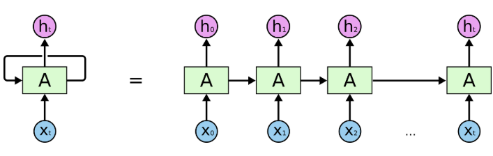
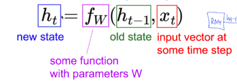
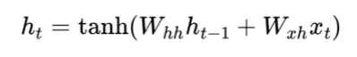

# Vanilla RNN ~ LSTM RNN

## Vanilla RNN

가장 단순한 형태의 RNN 모델

* t 자리에 1이 증가할 때 마다 input이 들어오고 있는 시계열 데이터

 

- 여기서 y와 위의 ht 는 다름! y는 **예측 값**, ht 는 **상태**

- 이 그림에서는 예측 값인 y를 표현하는 대신 상태를 의미하는 h는 표시하지 않은 것

  > 밑에 y와 h가 함께 표시된 그림 있음

- **y가 전달되는 것이 아니라 ht-1가 ht로 전달되는 것**임에 주의 !

* state 개념 존재
  * 예전 상태와 x값을 입력으로 받고, 특정 함수를 거쳐서 new state 가 탄생
* 셀에서 만들어지는 상태 데이터는 보통 hidden state 라고 함 ( ht로 표기 )

* old state 와 x를 input으로 사용하여 new state를 구함.

* 여기서 fw 는 **tanh** 함수

  * 

    > hh는 