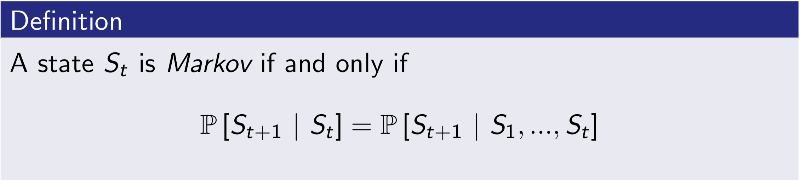
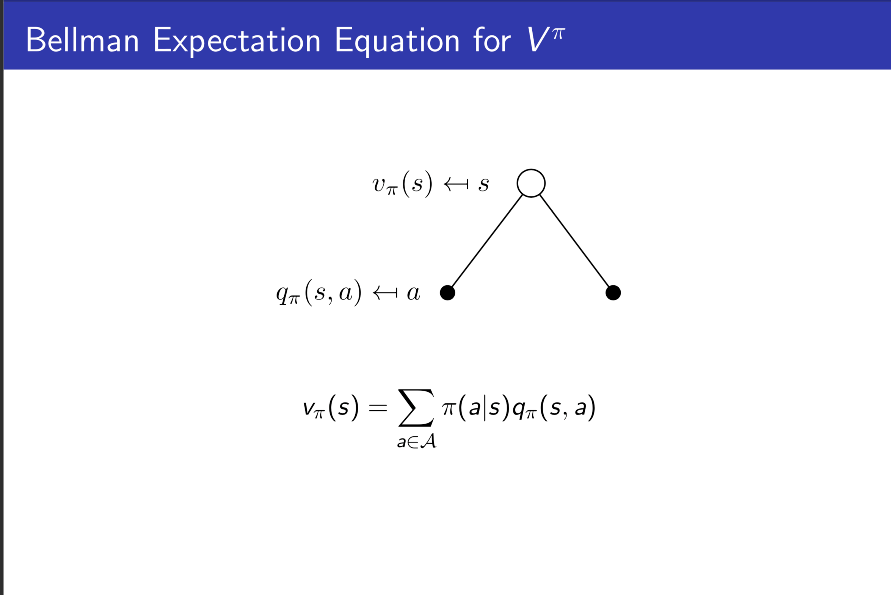

# **Markov Decision Process**

# **1. Introduction**
- Markov Decision Processes formally ***describe an environment*** for reinforcement learning
- Where the environment is ***fully observable***

# **2. Markov Process**

## **1) Markov Property**
***The future is independent of the past given the present*** 
***(현재의 미래는 현재의 과거로부터 독립적이다)***

- 시작 S1 부터 미래 St+1에 도달할 확률과, 현재 St에서 St+1에 도달할 확률이 동일하다.
- 현재는 과거의 미래이며, 현재는 과거의 정보들을 가지고있다.

## **2) State Transition Matrix**
- State s, s' 이 Markov 일 때, State Transition Probability 는 다음을 만족한다. 

- State Transition Matrix P 는 모든 State s 로부터 s' 으로 가는 State Transition Probability 를 정의합니다.

- State Transition Matrix에서 각각의 행을 구성하는 인자들의 총합은 1 이다.

## **3) Markov Process(or Markov Chain)**

***Markov Property를 만족하는 State들과, 이 State들 간의 State Transition Matrix 으로 구성된 Tuple***

 

 

# **3. Markov Reward Process**

## **1) Markov Reward Process**
***Markov Chain에 Reward가 추가된 Tuple***

 

## **2) Return**
- Return G는 어떤 Episode의 Step t 부터 매 Step마다 얻게되는 모든 Reward의 합을 의미한다.
- Discount r은 **7. Discount** 참고

 

## **3) Discount r**
- 0 이상 1 이하의 값, [0, 1]
- 미래의 Reward에 패널티를 가함으로써 현재 시점에서의 기댓값으로 변환한다.
- 먼 미래의 Reward 일 수록 많은 패널티를 얻게 된다.
- 먼 미래에 얻게될 Reward와, 가까운 미래에 얻게될 Reward의 경중을 조정하는 용도.
- r이 0에 가까울 수록 가까운 미래를 더 중요시한다.
- r이 1에 가까울 수록 먼 미래또한 중요시한다.
- Cyclic 상태에서 무한으로 빠지는 것을 방지하여 준다.

## **4) State Value Function of MRP**
***State s에서 앞으로 얻게될 것이라 기대되는 가치***
- Agent는 다음 State s' 으로 이동할때 v(s') 이 가장 큰 State로 이동한다.
- 학습을 반복하면서 Value Function은 업데이트 된다.

 

## **5) Bellman Equation for MRP**
***다음 State와 현재 State의 Value Function 사이의 관계를 식으로 나타낸 방정식.***

Value Function은 두 개의 파트로 나누어질 수 있다.
- 다음 State S' 의 보상 Rt+1
- 다음 State S' 에서의 Discouted Value Function rv(St+1)

 Bellman Equation for MRP의 전개과정

Backup diagram을 이용한 도식화

Bellman Equation의 Matrix Form

Bellman Equation 풀이
- Bellman Equation 은 선형 방정식
- n States 일때의 Computational Complexity는 O(n^3)
- 아래의 Direct Solution으로 바로 풀이가 가능
- 그러나 아래의 Direct Solution은 small MRP 일때만 사용가능 

- Large MRP의 경우는 다음 방법을 사용해 풀이 가능
    - Dynamic programming
    - Monte-Carlo evaluation
    - Temporal-Difference learning

# **4. Markov Decision Process**

## **1) Markov Decision Process**
***MRP에 Decision(Action)이 추가된 튜플***

 

## **2) Policy**
***State s에서 Action a를 할 확률***

 

## **3) Value Function**
### **(1)State-Value Function**
***State s에서 Policy를 따랐을 때, 얻게될 것이라 기대되는 가치***

### **(2)Action-Value Function**
***State s에서 Policy를 따라 Action a 를 했을 때, 얻게될 것이라 기대되는 가치***

## **4) Bellman Expectation Equation for MDP**

### **(1) State-Value Function**

### **(2) Action-Value Function**

### **(3) Backup Diagram**

 

### **(4) Direct Solution**

## **5) Optimal Value Function**

***모든 Policy의 경우를 따졌을 때, 가장 큰 Value Function***

 

## **6) Optimal Policy**
***Optimal Value Function의 Policy***

### **Finding an Optimal Policy**
***해설 : State s에서 선택할 수 있는 Action들 중, 어떤 Action a의 Optimal Value Function q∗(s,a)가 가장 클 때,  π∗(a|s)를 1로 설정한다. 그리고 그 외의 Action a'들의 π∗(a'|s)를 0으로 설정한다.***

## **7) Bellman Optimality Equation**

 

