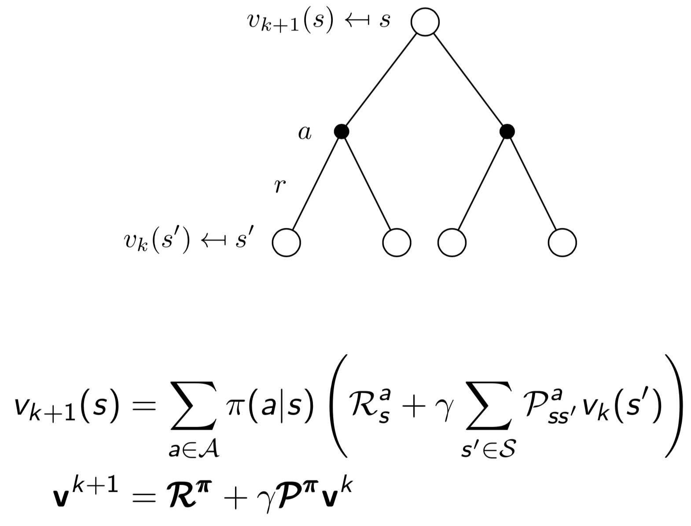

# **Planning by Dynamic Programming**

# **1. Introduction**  

## What is Dynamic Pragramming?

The term ***dynamic programming*** refers to a ***collection of algorithms*** that can be used to ***compute optimal policies*** given a perfect model of the environment as a Markov decision process

## Two properties of Dynamic Programming

1. Optimal subproblem
    - *Principle of optimality* applies
    - Optimal solution can be decomposed into subproblems
2. Overlapping subproblem
    - Subproblems recur many times
    - Solutions can be cached and reused

* Markov decision processes satisfy both properties
    * Bellman equation gives recursive decomposition
    * Value function stores and reuses solutions

## Planning and Learning

* Planning
    * ***The model of the environment is knwon***
    * The agent performs computations with its model (without any external interaction)
    * The agent improves its policy    
* Learning
    * ***The environment is initially unknown***
    * The agent iteracts with the environment
    * The agent improves its policy

## Prediction and Control

* Prediction : Evaluate the future
    * Given a policy
* Control : optimise the future
    * Find the best policy

## Planning by Dynamic Programming

* Dynamic programming assumes full knowledge of the MDP
* It is used for planning in an MDP

DP는 Prediction과 Control을 반복하며 다음과 같이 동작합니다.
1. 현재의 Policy를 사용해 Value function을 구합니다. (Prediction)
2. 구해진 Value function을 바탕으로 Policy를 업데이트 합니다. (Control)

# **2. Policy Evaluation**

* Prediction 단계
* 현재의 Policy를 사용해 Value function을 구합니다.

## Iterative Policy Evaluation
* Bellman expectation backup 을 반복적으로 사용하는 방법.

## Bellman Equation

## Example

 

# **3. Policy Iteration**

## How to Improve a Policy

## Policy Iteration

## Policy Improvement (증명)

## Extension to policy Iteration
- 그런데 2. Policy Evaluation의 Iterative Policy Evaluaion을 몇번이나 해야하는가?
- 꼭 수없이 많은 단계의(e.g K=1000) Evalution을 한 뒤에 Policy Improvement를 해야하는가?
- 적당한 때에 (e.g K=5) 끊고, Policy Improvement를 하면 안되는가? -> ***Value Iteration***

# **4. Value Iteration**

## Principle of Optimality

- s1 -> s2, s2가 s1의 Successor state, s2에서 optimal value가 존재한다면 s1에서도 optimal value를 찾을 수 있다.

## Deterministic Value Iteration
- 만약 Bellman Optimality Equation을 통해 Final state부터 시작해서 V*(s)를 구할 수 있다.

## Example

## Value Iteration

# **5. Summary**

# **6. Asynchronous Dynamic Programming**

- In-place dynamic programming
- Prioritised sweeping
- Real-time dynamic programming

