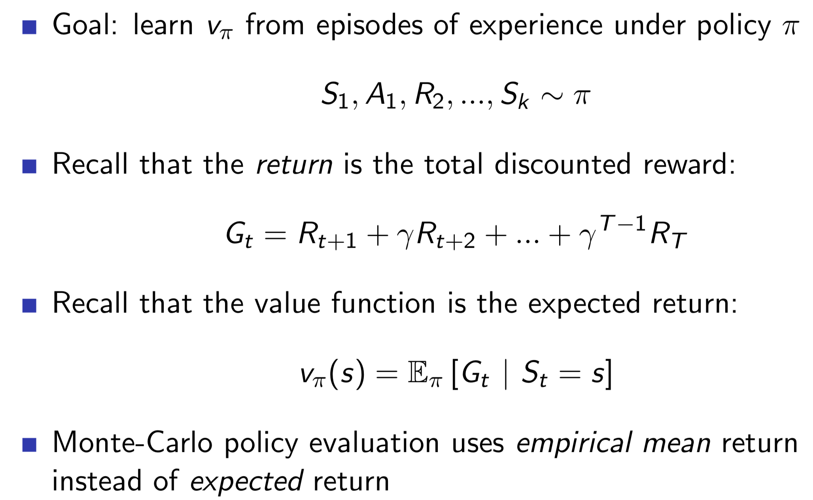
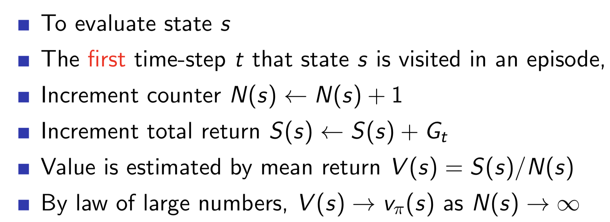
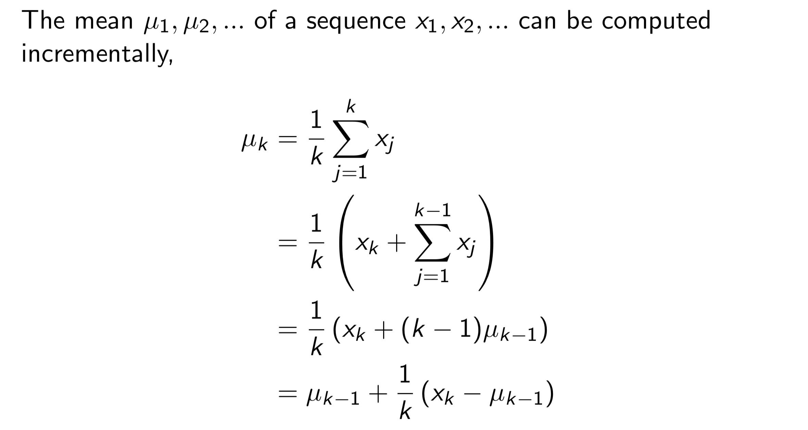
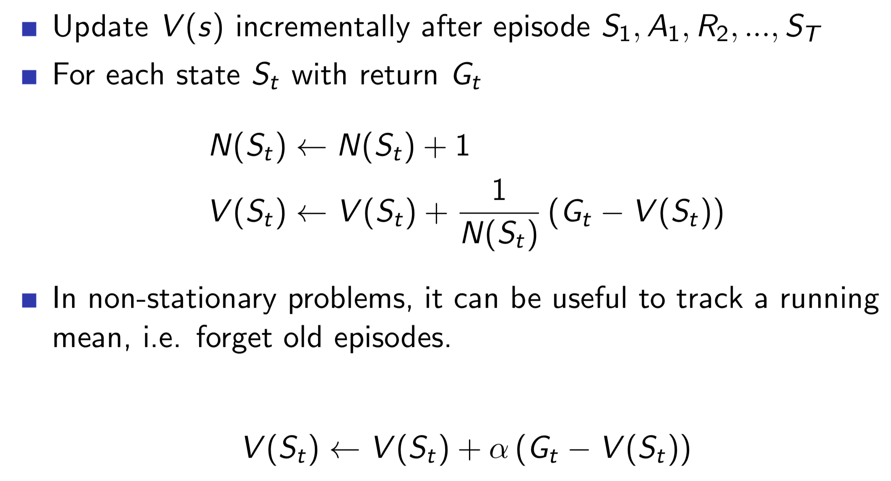

# **Model-Free Prediction**

***Policy를 따라 학습을 진행하면서, Sample backup을 통해 Value Function을 Update하는 것을 Model-Free Prediction이라 한다.***

- Model-Free : Environment의 model을 모르는 상태로 학습을 진행한다.
- DP는 model을 알아야 학습이 가능했다(Model-based).
- Agent가 Trial-and-Error(시행착오)를 통해 학습을 진행한다.
- 모든 경로를 사용해 Update하는 Full-width backup이 아닌, 실제 경험한 경로만 사용해 Update하는 Sample backup을 사용한다.
- Model-Free 방법은 두 가지가 존재한다.
    - Monte-Carlo
    - Temporal-Difference

# **1. Monte-Carlo Learning**  

## Monte-Carlo Reinforcement Learning

- 매 episode가 끝날 때 마다 Update를 진행하는 방법
- MC methods learn directly from episodes of experience
- MC is model-free: no knowledge of MDP transitions / rewards
- MC learns from complete episodes: no bootstrapping
- MC uses the simplest possible idea: value = mean return
- ***All episodes must terminate***

## Monte-Carlo Policy Evaluation
- Policy를 따라 episode를 진행한 뒤, final state부터 거꾸로 되짚어 가면서 각 state들의 Value function을 업데이트한다.
- 어떤 State s의 Value는, 여러 episode들이 s를 지나가면서 나온 Value들의 **평균**을 사용한다.

***만약 한 episode 에서 어떤 State s를 여러번 지나간다면?***
-> First-Visit vs Every-Visit

## First-Visit Monte-Carlo Policy Evaluation
***한 episode에서 어떤 State s를 여러번 지나간다면, 첫번째 방문했을 때의 Value만 사용한다.***
- First-Visit을 Every-Visit 보다 많이 사용한다.

## Every-Visit Monte-Carlo Policy Evaluation
***한 episode에서 어떤 State s를 여러번 지나간다면, 모든 방문의 Value들의 평균을 사용한다.***

## Incremental Mean
- Incremental Sequence의 k번째 평균을 구하기 위한 사전 수학지식

## Incremental Monte-Carlo Updates
- 앞선 Incremetal Mean 공식을 활용해 State들의 Value를 Update하는 방법

# **2. Temporal-Difference Learning**

# **3. TD(λ)**