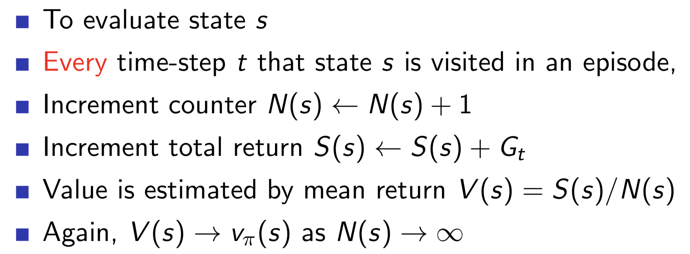
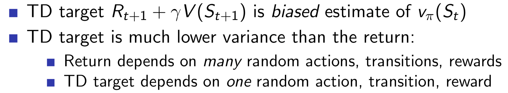
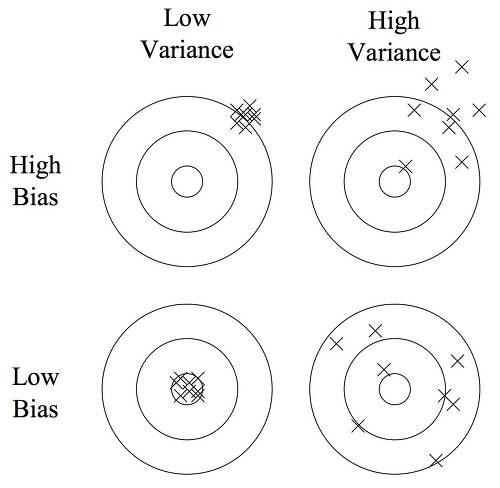
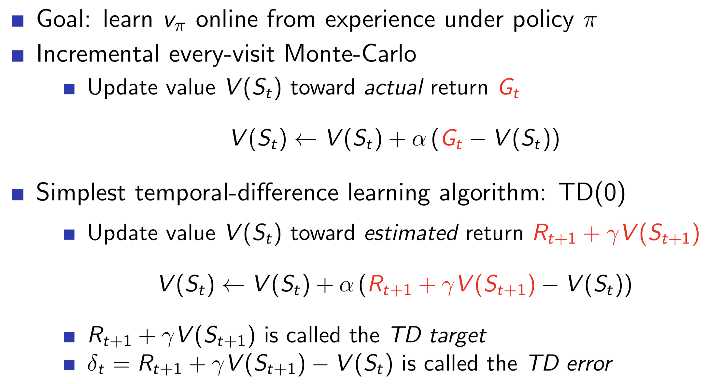
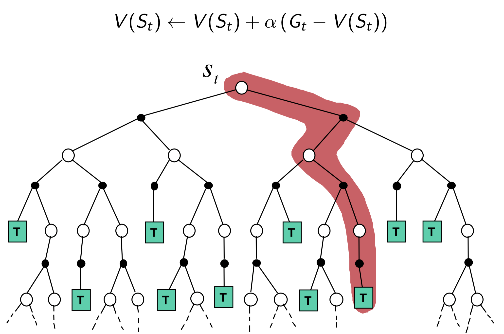
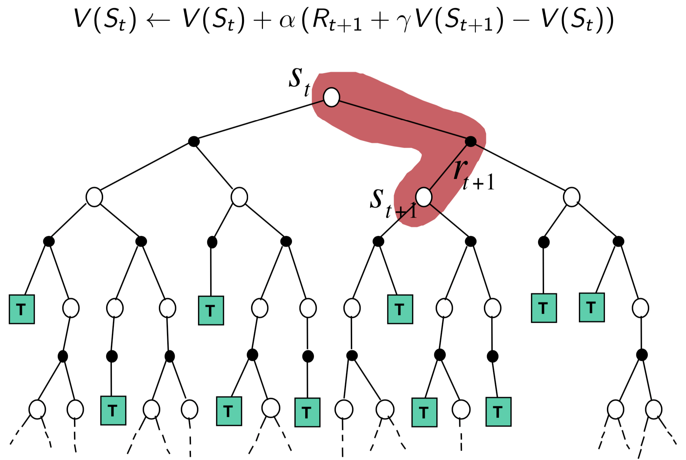
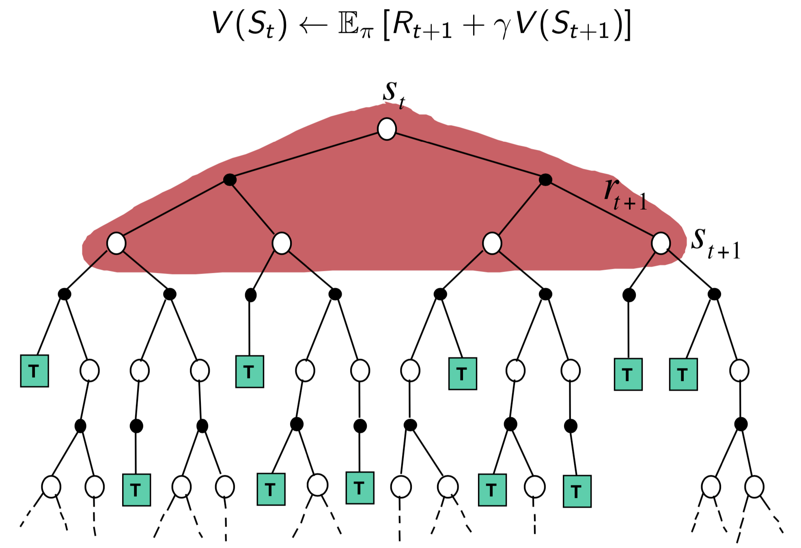
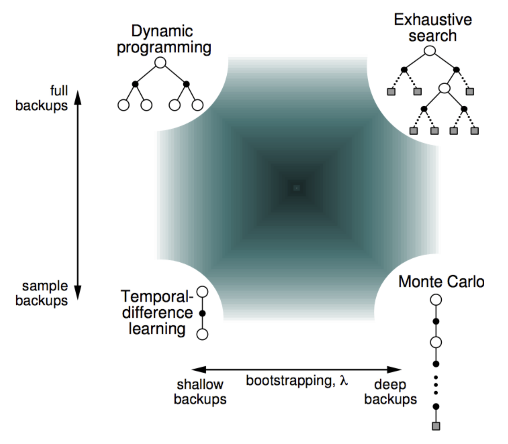

# **Model-Free Prediction**

***Policy를 따라 학습을 진행하면서, Sample backup을 통해 Value Function을 Update하는 것을 Model-Free Prediction이라 한다.***

- Model-Free : Environment의 model을 모르는 상태로 학습을 진행한다.
- DP는 model을 알아야 학습이 가능했다(Model-based).
- Agent가 Trial-and-Error(시행착오)를 통해 학습을 진행한다.
- 모든 경로를 사용해 Update하는 Full-width backup이 아닌, 실제 경험한 경로만 사용해 Update하는 Sample backup을 사용한다.
- Model-Free 방법은 두 가지가 존재한다.
    - Monte-Carlo
    - Temporal-Difference

# **1. Monte-Carlo Learning**  

## Monte-Carlo Reinforcement Learning

- 매 episode가 끝날 때 마다 Update를 진행하는 방법
- MC methods learn directly from episodes of experience
- MC is model-free: no knowledge of MDP transitions / rewards
- MC learns from complete episodes: no bootstrapping
- MC uses the simplest possible idea: value = mean return
- ***All episodes must terminate***

## Monte-Carlo Policy Evaluation
- Policy를 따라 episode를 진행한 뒤, final state부터 거꾸로 되짚어 가면서 각 state들의 Value function을 업데이트한다.
- 어떤 State s의 Value는, 여러 episode들이 s를 지나가면서 나온 Value들의 **평균**을 사용한다.

***만약 한 episode 에서 어떤 State s를 여러번 지나간다면?***
-> First-Visit vs Every-Visit

## First-Visit Monte-Carlo Policy Evaluation
***한 episode에서 어떤 State s를 여러번 지나간다면, 첫번째 방문했을 때의 Value만 사용한다.***
- First-Visit을 Every-Visit 보다 많이 사용한다.

## Every-Visit Monte-Carlo Policy Evaluation
***한 episode에서 어떤 State s를 여러번 지나간다면, 모든 방문의 Value들의 평균을 사용한다.***

## Incremental Mean
- Incremental Sequence의 k번째 평균을 구하기 위한 사전 수학지식

## Incremental Monte-Carlo Updates
- 앞선 Incremetal Mean 공식을 활용해 State들의 Value를 Update하는 방법

# **2. Temporal-Difference Learning**

## Temporal-Difference Learning

- 학습을 진행하면서 매 Step의 State마다 Update를 진행하는 방법
- TD methods learn directly from episodes of experience
- TD is model-free: no knowledge of MDP transitions / rewards
- TD learns from ***incomplete episodes***, by bootstrapping
- TD updates a guess towards a guess

## Bias and Variance Trade-Off
- **Bias** : 데이터가 중심으로 부터 벗어난 정도
- **Variance** : 데이터가 분포된 정도
- Bias와 Variance는 Trade-Off 관계로, 하나가 높으면 하나가 낮은 성질이 있다.
- TD는 매 Step마다 업데이트가 진행되기 때문에, 초기 Step에 Bias가 많이 영향을 받는다. (Bias 높음)
- MC는 episode가 끝날때 학습하여, 경로의 모든 Step을 반영하기 때문에 초기 episode에 Variance가 많이 영향을 받는다. (Variance 높음)

  
  
출처 : https://bywords.tistory.com/

## MC VS TD

  

## Advantages and Disadvantages of MC vs TD

### Learning
- TD can learn before knowing the final outcome
    - TD can learn online after every step
    - MC must wait until end of episode before return is known
- TD can learn without the final outcome
    - TD can learn from incomplete sequences
    - MC can only learn from complete sequences
    - TD works in continuing (non-terminating) environments
    - MC only works for episodic (terminating) environments

### Bias, Variance
- MC has high variance, zero bias
    - Good convergence properties
    - (even with function approximation)
    - Not very sensitive to initial value
    - Very simple to understand and use
- TD has low variance, some bias
    - Usually more efficient than MC
    - TD(0) converges to vπ(s)
    - (but not always with function approximation)
    - More sensitive to initial value

### Efficiency
- TD exploits Markov property
    - Usually more efficient in Markov environments
- MC does not exploit Markov property
    - Usually more effective in non-Markov environments

# **3. MC vs TD vs DP**

## Backup

### Monte Carlo

  

### Temporal Difference

  

### Dynamic Programming

  

## Bootstrapping and Sampling

- **Bootstrapping** : update involves an estimate
    - MC does not bootstrap
    - TD bootstrap
    - DP bootstrap
- **Sampling** : update samples an expectation
    - MC samples
    - TD samples
    - DP does not sample

## Unified View of Reinforcement Learning

  